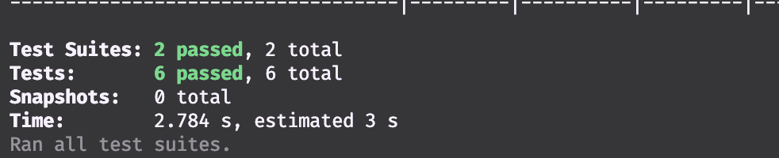

# Getir Records API Assessment
RESTful API for fetching records using date and count as filter options.

## Getting Started

1. You need to have Node.js installed. You can download and install Node.js [here](http://nodejs.org/)
2. Install project dependencies by running `npm install`.
3. Create a `.env` file in the root directory. It should have the following properties:
- PORT
- MONGODB_URI
- NODE_ENV
4. Start the application by running `npm start`.

## Documentation
A Postman documentation for the API can be accessed [here](https://www.getpostman.com/collections/e941d2f30906db769b78). It contains sample requests and responses, as well as an explanation of the request and response fields.

## Tests
This project includes both unit and integration tests. Run the tests by running `npm test`. This is a screenshot of the test results:

